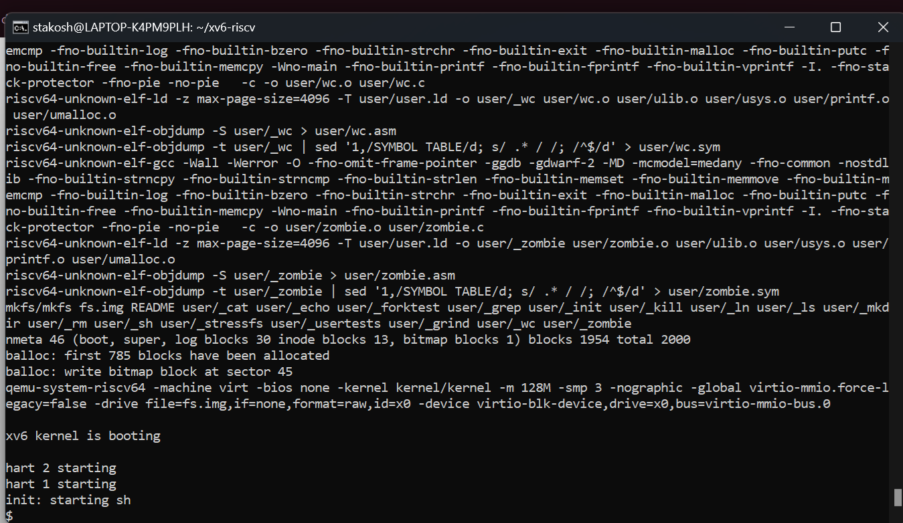
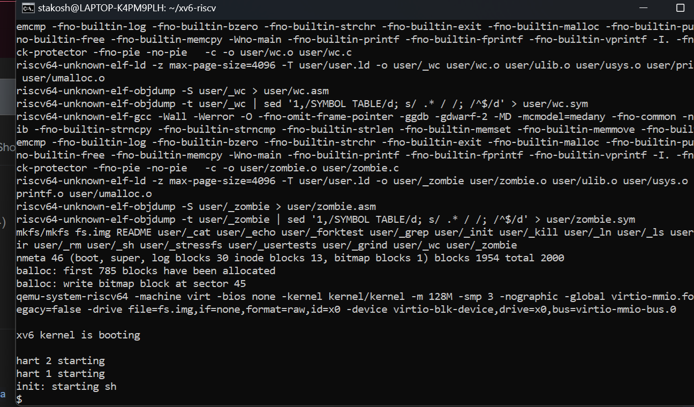

# Instalación de xv6

## Pasos Seguidos para la Instalación

1. **Clonar el repositorio de QEMU:**
   ```
  `git checkout -b mi-rama-personalizada`
  `git clone https://gitlab.com/qemu-project/qemu.git`
  `cd qemu`
  `git submodule init`
  `git submodule update --recursive`
  `./configure`
  `make`
  `sudo make install`
   ```

2. **Instalar RISC-V GNU Compiler Toolchain:**
   ```
  `sudo apt-get install autoconf automake autotools-dev curl python3 python3-pip libmpc-dev libmpfr-dev libgmp-dev gawk build-essential bison flex texinfo gperf libtool patchutils bc zlib1g-dev libexpat-dev ninja-build git cmake libglib2.0-dev libslirp-dev`

  `git clone https://github.com/riscv/riscv-gnu-toolchain`

   # Para construir el cross-compiler Newlib, elige un directorio de instalación (con permisos de escritura). 
   # Por ejemplo, si eliges /opt/riscv, añade /opt/riscv/bin a tu PATH.

  `./configure --prefix=/opt/riscv`
  `sudo make`
   ```

3. **Clonar el repositorio de xv6:**
   ```
  `git clone https://github.com/mit-pdos/xv6-riscv.git`
  `cd xv6-riscv`
  `make qemu`
   ```

## Problemas y Resoluciones

- **Problema:** Al ejecutar los pasos en un orden incorrecto, solo se ejecutaba QEMU, pero no xv6.
- **Solución:** Se modificó el `Makefile`, reemplazando `-nographic` por otro comando que generaba una nueva ventana con QEMU. Aunque no resolvió el problema, se decidió empezar desde cero, eliminando todas las carpetas y bibliotecas descargadas, y siguiendo los pasos en el orden correcto. Al hacer esto, `make qemu` funcionó sin problemas.

## Pruebas de Funcionamiento

- Se adjuntan capturas de pantalla como evidencia de que los comandos se ejecutaron correctamente:=
  
  
  

