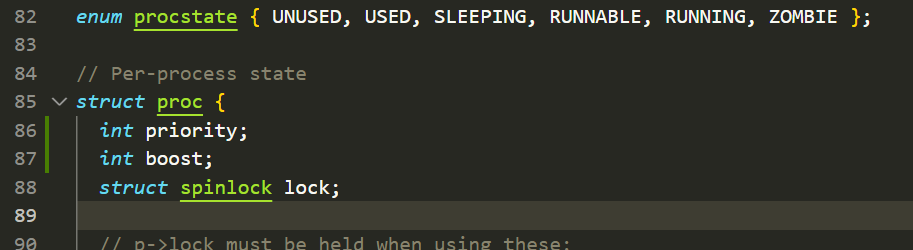
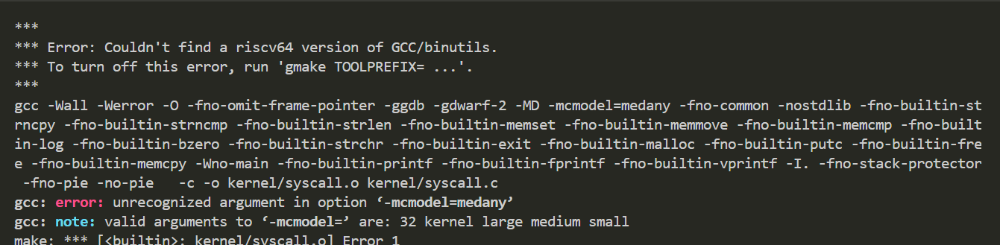
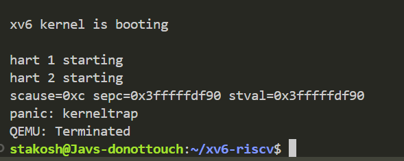
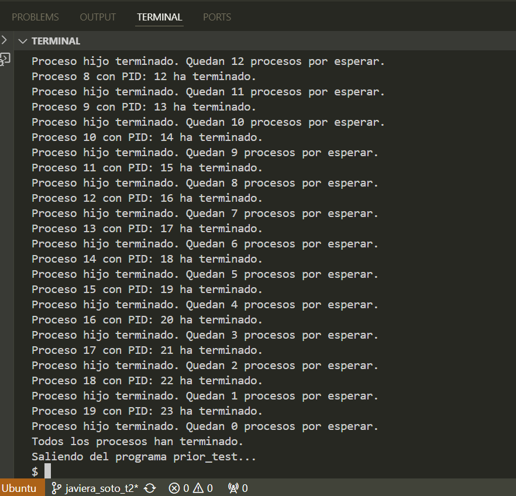

Informe Tarea 2

## Funcionamiento y lógica del sistema de prioridades

archivos de xv6 necesarios de leer para entender el funcionamiento: 

- ``` proc.h ```
Definición de la estructura proc
pid: Identificador del proceso
state: Estado del proceso
priority: Nivel de prioridad (si decides añadir prioridades, aquí se agrega el campo)
Locks necesarios para proteger las operaciones sobre los procesos

- ```proc.c ```
allocproc() permite asignar una estructura proc para un nuevo proceso
scheduler() el encargado de seleccionar qué proceso se ejecuta 
sleep() y wakeup() para suspender y despertar procesos

- ``` scheduler() ``` ya mencionado anteriormente, es el planificador del sistema operativo. Se ejecuta en un bucle infinito y selecciona qué proceso correr entre los que están en estado RUNNABLE (listos para ejecutarse). Muy importante la modificacion correcta de esta funcion para la implementacion del sistema de prioridades

## Explicación de las modificaciones realizadas.

```proc.c```: Implementación de la lógica de los procesos
```proc.h```: Definición de la estructura proc, donde agregaremos los campos de prioridad y boost.


## Procedimiento: 

1) en ```kernel/proc.h``` dentro de la estructura struct proc, se agregan los nuevos campos ```priority``` y ```boost```




2) en kernel/proc.c y buscar la función allocproc()
Añadir codigo para inicializar los campos priority y boost (no hay error al ejecutar qemu con esos cambios hasta el momento)

3) Incorporar la lógica de boost en el planificador 
Ir a kernel/proc.c y buscar la función scheduler().
Dentro de la lógica del planificador agregar la lógica para incrementar la prioridad y ajustar el boost, ademas de la prioridad de seleccion de proceso

```
 void scheduler(void) {
  struct proc *p;
  struct proc *high_p;
  struct cpu *c = mycpu();
  int boost_interval = 1000;  // Intervalo para aplicar el boost de prioridad.
  int iteration_count = 0;    // Contador de iteraciones del scheduler.

  c->proc = 0;
  for (;;) {
    // Habilitar interrupciones para evitar deadlocks.
    intr_on();

    high_p = 0;

    // Realizar boost de prioridad cada cierto número de iteraciones.
    if (iteration_count % boost_interval == 0) {
      for (p = proc; p < &proc[NPROC]; p++) {
        acquire(&p->lock);
        if (p->state == RUNNABLE) {
          // Restablecer la prioridad del proceso para evitar inanición.
          p->priority = 0;  // La prioridad más alta (valor más bajo).
        }
        release(&p->lock);
      }
    }

    // Buscar el proceso con mayor prioridad. // logica seleccion de proceso
    for (p = proc; p < &proc[NPROC]; p++) {
      acquire(&p->lock);
      if (p->state == RUNNABLE) {
        if (high_p == 0 || p->priority < high_p->priority) {
          if (high_p != 0) {
            release(&high_p->lock);
          }
          high_p = p;
        } else {
          release(&p->lock);
        }
      } else {
        release(&p->lock);
      }
    }

    if (high_p != 0) {
      // Cambiar el estado del proceso a RUNNING y hacer el cambio de contexto.
      high_p->state = RUNNING;
      c->proc = high_p;
      swtch(&c->context, &high_p->context);

      // El proceso ha terminado de ejecutarse por ahora.
      c->proc = 0;
      release(&high_p->lock);
    } else {
      // No hay procesos para ejecutar; esperar a que ocurra una interrupción.
      intr_on();
      asm volatile("wfi");
    }

    iteration_count++;  // Incrementar el contador de iteraciones.
  }
}

```

4) Creacion del programa de prueba 

Crear un archivo llamado ``` prior_test.c ``` en el directorio user.

```
#include "kernel/types.h"
#include "kernel/stat.h"
#include "user/user.h"

void prior_test() {
    printf("Iniciando la prueba de prioridades con 20 procesos.\n");
    printf("Creando 20 procesos usando fork()...\n");

    int i;

    // Crear 20 procesos usando fork
    for (i = 0; i < 20; i++) {
        printf("Creando proceso %d...\n", i);  // Mensaje antes del fork
        int pid = fork();

        if (pid == 0) {  // Proceso hijo
            // Asignar una prioridad inversa al índice del proceso
            int priority = i;
            printf("Proceso hijo creado: %d con PID: %d y prioridad: %d\n", 
                   i, getpid(), priority);

            // Simular ejecución: procesos menos prioritarios duermen más tiempo
            printf("Proceso %d con PID: %d durmiendo por %d segundos.\n", 
                   i, getpid(), priority * 5);
            sleep(priority * 5);  // Sleep proporcional a la "prioridad"

            printf("Proceso %d con PID: %d ha terminado.\n", i, getpid());
            exit(0);  // Terminar el proceso hijo
        }
    }

    // Código del proceso padre: Espera a que todos los hijos terminen
    printf("Esperando a que todos los procesos hijos terminen...\n");
    for (i = 0; i < 20; i++) {
        wait(0);  // Esperar que cada hijo termine
        printf("Proceso hijo terminado. Quedan %d procesos por esperar.\n", 19 - i);
    }

    printf("Todos los procesos han terminado.\n");
}

int main(int argc, char *argv[]) {
    printf("Iniciando el programa prior_test...\n");
    prior_test();  // Ejecutar la prueba
    printf("Saliendo del programa prior_test...\n");
    exit(0);  // Salir del programa
} 
```

Se crean 20 procesos hijos mediante ```fork()```
Asigna a cada proceso una prioridad proporcional a su númeo 
Simula la ejecución al hacer que los prrocesos duerman un tiempo proporcional a su prioridad usando ```sleep(priority * 5)``` (procesos con menor prioridad duermen más tiempo)

Proceso padre:
Espera a que todos los procesos hijos terminen utilizando ```wait()```
Imprime mensajes indicando el progreso de la terminación de los procesos

En el ```main()```, se llama a ```prior_test()``` para realizar la prueba y al final el programa se cierra con ```exit()```

5) Modificar el Makefile para compilar el nuevo programa agregando ```$U/_prior_test``` 


## Dificultades encontradas y soluciones implementadas.


1. intento ejecutar qemu (no he hecho ningún cambio previo de la entrega anterior y en la entrega anterior funcionaba) 
y ahora no funciona, no encuentra las carpetas, no encontraba los archivos




Instalo lo que me dice que no está

```
sudo apt-get install gcc-riscv64-linux-gnu binutils-riscv64-linux-gnu
```

Ejecuto qemu
```
make TOOLPREFIX=riscv64-linux-gnu- qemu
```
Sigue diciendo que me faltan archivos para ejecutar qemu, lo cual es raro porque no he tocado los archivos

Procedo a borrar todo e instalar desde cero siguiendo el informe de la tarea 0.

2. tuve un problema con la ubicacion de memoria en el que pase un dia intentando modificar codigo, pero leyendo el codigo original me di cuenta que lo que estaba haciendo no tenia mucho sentido, asi que volvi a comenzar desde el codigo original y empecé a modificar el codigo utilizando los pasos mencionados y ejecutando cada vez qemu para ir solucionando errores en el momento




3. Se ejecuta 


 
Pero no podemos verificar que existe un orden de prioridad porque no hemos asignado prioridades diferentes a los procesos

asi que se modifica el código de prueba y se agrega un main, que pide almacenar informacion de procesos, para luego imprimirlos de manera ordenada



