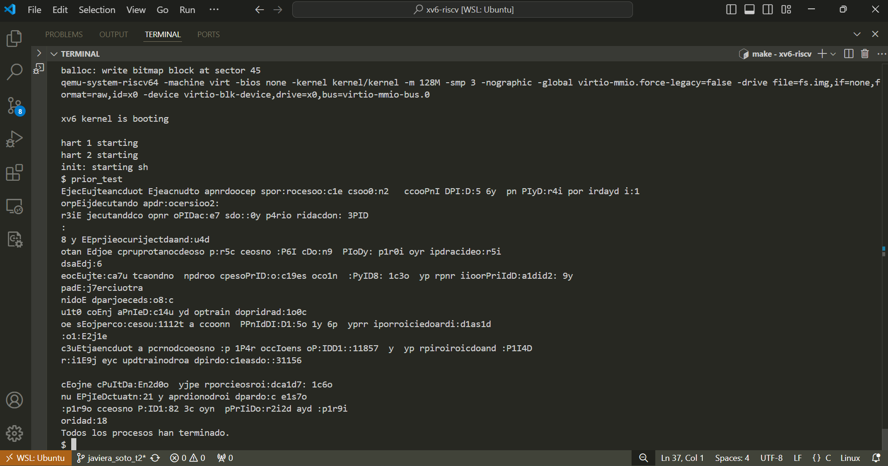

Informe Tarea 2

## Funcionamiento y lógica del sistema de prioridades

archivos de xv6 necesarios de leer para entender el funcionamiento: 

- ``` proc.h ```
Definición de la estructura proc
pid: Identificador del proceso
state: Estado del proceso
priority: Nivel de prioridad (si decides añadir prioridades, aquí se agrega el campo)
Locks necesarios para proteger las operaciones sobre los procesos

- ```proc.c ```
allocproc() permite asignar una estructura proc para un nuevo proceso
scheduler() el encargado de seleccionar qué proceso se ejecuta 
sleep() y wakeup() para suspender y despertar procesos

- ``` scheduler() ``` ya mencionado anteriormente, es el planificador del sistema operativo. Se ejecuta en un bucle infinito y selecciona qué proceso correr entre los que están en estado RUNNABLE (listos para ejecutarse). Muy importante la modificacion correcta de esta funcion para la implementacion del sistema de prioridades

## Explicación de las modificaciones realizadas.

```proc.c```: Implementación de la lógica de los procesos
```proc.h```: Definición de la estructura proc, donde deberás agregar los campos de prioridad y boost.


---------------------Procedimiento: ---------------------------------------------------

1) en ```kernel/proc.h``` dentro de la estructura struct proc, se agregan los nuevos campos ```priority``` y ```boost```


2) Abre el archivo kernel/proc.c y busca la función allocproc().
Añade la inicialización de los campos priority y boost (no hay error al ejecutar qemu con esos cambios hasta el momento)

3) Incorporar la lógica de boost en el planificador 
Abre kernel/proc.c y busca la función scheduler().
Dentro de la lógica del planificador (usualmente dentro del bucle for que recorre los procesos), debes agregar la lógica para incrementar la prioridad y ajustar el boost:

4) Modificar la lógica de selección de procesos en el scheduler
Debes asegurarte de que el planificador seleccione el proceso con la mayor prioridad disponible (el número más bajo tiene mayor prioridad).
Dentro de la función scheduler(), modifica la lógica de selección para escoger el proceso con la menor prioridad.

5) Crear el programa de prueba
Debes crear un programa de prueba que verifique el funcionamiento del sistema de prioridades. Puedes hacer esto creando un archivo nuevo en el directorio user.

Crea un archivo llamado prior_test.c en el directorio user.

Implementa un programa que cree múltiples procesos y verifique si los procesos se ejecutan en el orden de prioridad esperado

6) modificar el Makefile para compilar el nuevo programa añadiéndolo 

## Dificultades encontradas y soluciones implementadas.


1. intento ejecutar qemu (no he hecho ningún cambio previo de la entrega anterior y en la entrega anterior funcionaba) 
y ahora no funciona

foto error: error_1


cosas que tuve que hacer (porque al parecer en verdad no tenia nada instalado (??))

sudo apt-get install gcc-riscv64-linux-gnu binutils-riscv64-linux-gnu

make TOOLPREFIX=riscv64-linux-gnu- qemu
(sigue ejecutando mal)

procedo a borrar todo e instalar desde cero siguiendo el informe de la tarea 0.

2. tuve un problema con la ubicacion de memoria en el que pase un dia intentando modificar codigo, pero leyendo el codigo original me di cuenta que lo que estaba haciendo no tenia mucho sentido, asi que volvi a comenzar desde el codigo original y empecé a modificar el codigo utilizando los pasos mencionados y ejecutando cada vez qemu para ir solucionando errores en el momento

3. Se ejecuta (foto ejecución desordenada) pero no podemos verificar que existe un orden de prioridad porque no hemos asignado prioridades diferentes a los procesos

asi que se modifica el código de prueba
sleep(priority * 5)
Los procesos con menor prioridad (mayor valor de i) se detendrán más tiempo.
Por ejemplo, el proceso con prioridad 19 se detendrá por 19 * 5 = 95 segundos.

asi que se arreglo un poco el código para poder generar el mensaje en forma ordenada a medida que terminaban los procesos para ver si realmente funciona el orden de prioridad 



