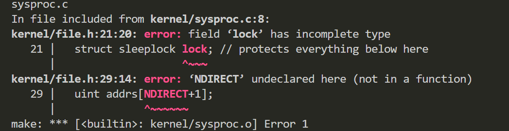
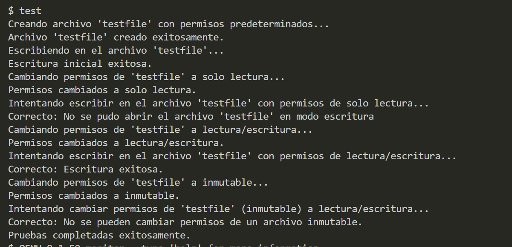

# **Implementación de Permisos Básicos en xv6 (RISC-V)**


## **Cambios Implementados**


### 1. Se creó el archivo `test.c` en la carpeta  `user.c` `  

### 2. Se agregó en el Makefile el archivo para test (actualmente vacio)

### 3. Modificar el archivo `file.h` y agregar un nuevo campo `int permissions` en la estructura `struct inode`
- Esto permite establecer el valor de los permisos

```
struct inode {
    ... (codigo ya existente)

    int permissions;     // Campo para permisos (0: ninguno, 1: lectura, 2: escritura, 3: lectura/escritura, 5: inmutable) **CAMPO NUEVO**
};
```
### 4. Dentro del archivo `fs.c` modificar el valor inicial de `permissions`

```
struct inode*
ialloc(uint dev, short type)
{
    int inum;
    struct buf *bp;
    struct dinode *dip;

    for (inum = 1; inum < NINODE; inum++) {
        bp = bread(dev, IBLOCK(inum, sb));
        dip = (struct dinode*)bp->data + inum % IPB;
        if (dip->type == 0) {  // Encontró un inode libre
            memset(dip, 0, sizeof(*dip));
            dip->type = type;
            log_write(bp);
            brelse(bp);

            struct inode *ip = iget(dev, inum); // Obtener el inode en memoria **linea nueva**
            ip->permissions = 3; // Establecer permisos predeterminados **linea nueva**
            return ip; **linea nueva**
        }
        brelse(bp);
    }
    panic("ialloc: no inodes");
    return 0;
}
```

### 5. Dentro del archivo `sysfile.c` modificar las operaciones de lectura, escritura y apertura de archivos

- `sys_open`:
```
uint64
sys_open(void)
{
  char path[MAXPATH];
  int fd, omode;
  struct file *f;
  struct inode *ip;
  int n;

  argint(1, &omode);
  if((n = argstr(0, path, MAXPATH)) < 0)
    return -1;

  begin_op();

  if(omode & O_CREATE){
    ip = create(path, T_FILE, 0, 0);
    if(ip == 0){
      end_op();
      return -1;
    }
  } else {
    if((ip = namei(path)) == 0){
      end_op();
      return -1;
    }
    ilock(ip);
    if(ip->type == T_DIR && omode != O_RDONLY){
      iunlockput(ip);
      end_op();
      return -1;
    }

    // **NUEVO: Verificación de permisos**
    if((ip->permissions & 1) == 0 && (omode & O_RDONLY)) {
      // No tiene permisos de lectura
      iunlockput(ip);
      end_op();
      return -1;
    }
    if((ip->permissions & 2) == 0 && (omode & O_WRONLY)) {
      // No tiene permisos de escritura
      iunlockput(ip);
      end_op();
      return -1;
    }
  }

  if(ip->type == T_DEVICE && (ip->major < 0 || ip->major >= NDEV)){
    iunlockput(ip);
    end_op();
    return -1;
  }

  if((f = filealloc()) == 0 || (fd = fdalloc(f)) < 0){
    if(f)
      fileclose(f);
    iunlockput(ip);
    end_op();
    return -1;
  }

  if(ip->type == T_DEVICE){
    f->type = FD_DEVICE;
    f->major = ip->major;
  } else {
    f->type = FD_INODE;
    f->off = 0;
  }
  f->ip = ip;
  f->readable = !(omode & O_WRONLY);
  f->writable = (omode & O_WRONLY) || (omode & O_RDWR);

  if((omode & O_TRUNC) && ip->type == T_FILE){
    itrunc(ip);
  }

  iunlock(ip);
  end_op();

  return fd;
}

```
- Lógica para verificar que el modo de apertura (omode) sea compatible con los permisos definidos en el inode

- `filewrite` (se encuentra en `file.c`)
```
// file.c
int
filewrite(struct file *f, uint64 addr, int n)
{
  int r, ret = 0;

  if(f->writable == 0)
    return -1;

  if(f->type == FD_PIPE){
    ret = pipewrite(f->pipe, addr, n);
  } else if(f->type == FD_DEVICE){
    if(f->major < 0 || f->major >= NDEV || !devsw[f->major].write)
      return -1;
    ret = devsw[f->major].write(1, addr, n);
  } else if(f->type == FD_INODE){
    // Verificación de permisos para escritura
    ilock(f->ip); // Bloqueamos el inode para evitar modificaciones concurrentes
    if((f->ip->permissions & 2) == 0) {
      iunlock(f->ip); // Desbloqueamos si no tiene permiso de escritura
      return -1; // No tiene permisos de escritura
    }
    iunlock(f->ip); // Desbloqueamos después de verificar los permisos

    // write a few blocks at a time to avoid exceeding
    // the maximum log transaction size, including
    // i-node, indirect block, allocation blocks,
    // and 2 blocks of slop for non-aligned writes.
    // this really belongs lower down, since writei()
    // might be writing a device like the console.
    int max = ((MAXOPBLOCKS-1-1-2) / 2) * BSIZE;
    int i = 0;
    while(i < n){
      int n1 = n - i;
      if(n1 > max)
        n1 = max;

      begin_op();
      ilock(f->ip);
      if ((r = writei(f->ip, 1, addr + i, f->off, n1)) > 0)
        f->off += r;
      iunlock(f->ip);
      end_op();

      if(r != n1){
        // error from writei
        break;
      }
      i += r;
    }
    ret = (i == n ? n : -1);
  } else {
    panic("filewrite");
  }

  return ret;
}

```
-  Verifica si el archivo tiene permiso de escritura.
- Esta verificación asegura que la escritura solo se permita si el inode tiene permisos de escritura (permissions & 2).


### 6. Definir las syscall de chmod
 
```
// syscall.h
#define SYS_chmod 22
```

```
// syscall.c
extern uint64 sys_chmod(void);
```

```
// syscall.c
[SYS_chmod] sys_chmod,
```

### 7. Agregar logica de chmod

```
//lógica de chmod
uint64
sys_chmod(void)
{
    char path[MAXPATH]; // Buffer para almacenar la ruta
    int mode;
    struct inode *ip;

    // Obtén los argumentos correctamente
    argstr(0, path, MAXPATH);
    argint(1, &mode);

    begin_op();
    if ((ip = namei(path)) == 0) { // Busca el inode por el nombre
        end_op();
        return -1; // Archivo no encontrado
    }
    ilock(ip);

    // Verifica si el archivo es inmutable
    if (ip->permissions == 5) {
        iunlockput(ip);
        end_op();
        return -1; // Archivo inmutable, no se pueden cambiar permisos
    }

    // Cambia los permisos
    ip->permissions = mode;
    iunlockput(ip);
    end_op();

    return 0; // Operación exitosa
}
```


------------------------------------

## **Programa de Pruebas**
El programa `test.c` 
```
#include "kernel/types.h"
#include "kernel/stat.h"
#include "kernel/fcntl.h"
#include "user/user.h"

void test_permissions() {
    int fd;
    char *filename = "testfile";

    printf("Creando archivo '%s' con permisos predeterminados...\n", filename);
    fd = open(filename, O_CREATE | O_RDWR);
    if (fd < 0) {
        printf("Error: No se pudo crear el archivo '%s'\n", filename);
        exit(1);
    }
    printf("Archivo '%s' creado exitosamente.\n", filename);

    printf("Escribiendo en el archivo '%s'...\n", filename);
    if (write(fd, "xv6", 3) != 3) {
        printf("Error: No se pudo escribir en el archivo '%s'\n", filename);
        exit(1);
    }
    printf("Escritura inicial exitosa.\n");
    close(fd);

    printf("Cambiando permisos de '%s' a solo lectura...\n", filename);
    if (chmod(filename, 1) < 0) {
        printf("Error: No se pudo cambiar permisos a solo lectura\n");
        exit(1);
    } else {
        printf("Permisos cambiados a solo lectura.\n");
    }

    printf("Intentando escribir en el archivo '%s' con permisos de solo lectura...\n", filename);
    fd = open(filename, O_WRONLY);
    if (fd >= 0) {
        if (write(fd, "fail", 4) == 4) {
            printf("Error: Escritura exitosa, pero no debería ser posible\n");
            exit(1);
        }
        close(fd);
    } else {
        printf("Correcto: No se pudo abrir el archivo '%s' en modo escritura\n", filename);
    }

    printf("Cambiando permisos de '%s' a lectura/escritura...\n", filename);
    if (chmod(filename, 3) < 0) {
        printf("Error: No se pudo cambiar permisos a lectura/escritura\n");
        exit(1);
    } else {
        printf("Permisos cambiados a lectura/escritura.\n");
    }

    printf("Intentando escribir en el archivo '%s' con permisos de lectura/escritura...\n", filename);
    fd = open(filename, O_WRONLY);
    if (fd >= 0) {
        if (write(fd, "pass", 4) == 4) {
            printf("Correcto: Escritura exitosa.\n");
        } else {
            printf("Error: No se pudo escribir en el archivo\n");
            exit(1);
        }
        close(fd);
    } else {
        printf("Error: No se pudo abrir el archivo en modo escritura\n");
        exit(1);
    }

    printf("Cambiando permisos de '%s' a inmutable...\n", filename);
    if (chmod(filename, 5) < 0) {
        printf("Error: No se pudo cambiar permisos a inmutable\n");
        exit(1);
    } else {
        printf("Permisos cambiados a inmutable.\n");
    }

    printf("Intentando cambiar permisos de '%s' (inmutable) a lectura/escritura...\n", filename);
    if (chmod(filename, 3) < 0) {
        printf("Correcto: No se pueden cambiar permisos de un archivo inmutable.\n");
    } else {
        printf("Error: Permisos cambiados, pero no debería ser posible\n");
        exit(1);
    }

    printf("Pruebas completadas exitosamente.\n");
    close(fd);
}

int main(int argc, char *argv[]) {
    test_permissions();
    exit(0);
}
```


1. Al ejecutar deberias ver algo como:
```
Creando archivo 'testfile' con permisos predeterminados...
Archivo 'testfile' creado exitosamente.
Escribiendo en el archivo 'testfile'...
Escritura inicial exitosa.
Cambiando permisos de 'testfile' a solo lectura...
Permisos cambiados a solo lectura.
Intentando escribir en el archivo 'testfile' con permisos de solo lectura...
Correcto: No se pudo abrir el archivo 'testfile' en modo escritura
Cambiando permisos de 'testfile' a lectura/escritura...
Permisos cambiados a lectura/escritura.
Intentando escribir en el archivo 'testfile' con permisos de lectura/escritura...
Correcto: Escritura exitosa.
Cambiando permisos de 'testfile' a inmutable...
Permisos cambiados a inmutable.
Intentando cambiar permisos de 'testfile' (inmutable) a lectura/escritura...
Correcto: No se pueden cambiar permisos de un archivo inmutable.
Pruebas completadas exitosamente.

```

- Esto verifica que:
* Los permisos se establecen correctamente.
* Las restricciones de lectura/escritura funcionan según lo esperado.
* Los archivos inmutables no permiten cambios de permisos.

------------------------------------

## **Errores y Soluciones**

1. 
```
riscv64-linux-gnu-ld: user/ulib.o: in function `start':
/home/stakosh/xv6-riscv/user/ulib.c:13: undefined reference to `main'
make: *** [Makefile:100: user/_test] Error 1
```

- El crear un archivo y dejarlo en blanco al intentar ejecutar qemu, genero error
- Solución: Crear una funcion vacia dentro del archivo nuevo

2. Luego de terminar de implementar todos los pasos, me daba error por algunas funciones sin definicion 



- Solucion: importar librerias faltantes a `sysproc.c`

```
#include "proc.h"
#include "sleeplock.h"
#include "fs.h"
#include "file.h"
```

3. No se encontraba una declaración previa para la funcion `chmod`
- Solucion: Agrega la Declaración 

```
// user/user.h

int chmod(const char *path, int mode);
```

4. Aun hay problemas con reconocer chmod, puede ser que no esté implementada del todo la syscall
- Solucion:
Agrega chmod a usys.S
```
.global chmod
chmod:
 li a7, SYS_chmod
 ecall
 ret
 ```

5. Ademas, se agregó lo siguiente a `stat.h`
```
#define PERMISSION_NONE       0
#define PERMISSION_READ       1
#define PERMISSION_WRITE      2
#define PERMISSION_RW         3
#define PERMISSION_IMMUTABLE  5
```

6. en `usys.pl` se agregó `entry("chmod");`


## **Ejución Exitosa**

